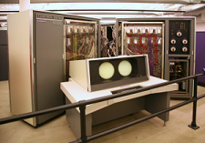
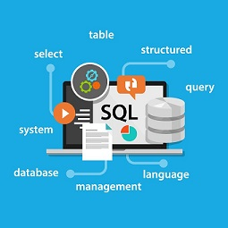
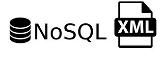
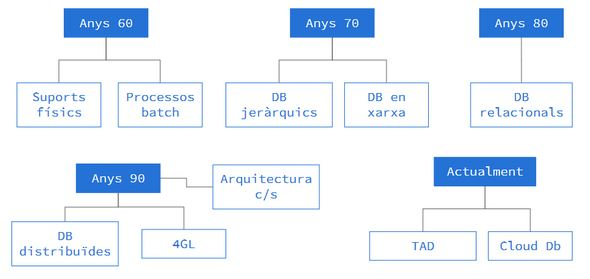
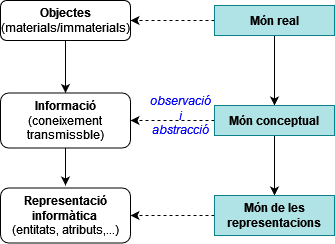

## UF1. Introducció a les bases de dades

### 1. Introducció
Una **dada** és una representació simbòlica (numèrica, alfabètica, …) d'una entitat (objecte de la vida real). No té valor semàntic (sentit) per si mateixa. En canvi, si contextualitzem aquesta dada, estem generant **informació**. El ordinadors no són capaços d’interpretar la informació per si mateixos (a diferència dels éssers humans, que sí que ho podem fer). Els programes informàtics però,  necessiten dades (d’entrada) per a poder executar-se, que analitzen i transformen, i així retornar noves dades (de sortida) de valor per a l’usuari del programa.

Les **metadades** són dades sobre les dades. És tota aquella informació descriptiva sobre el context, qualitat, condició o característiques d'un recurs, dada o objecte amb la finalitat de facilitar-ne la recuperació, autentificació, avaluació, preservació i/o interoperabilitat.

Així, disposem de moltes dades que calen relacionar i emmagatzemar, per tal de generar coneixement i per poder accedir a la informació, en qualsevol moment. La col·lecció de dades rellevant per a una entitat (empresa, escola, …) s’anomena **base de dades** (*database*, DB).

### 2. Gestió de les bases de dades
Com s'han gestionat les dades al llarg dels anys? A continuació analitzem les característiques principals de cada periode:
 
**Anys 60 - 70**
- Aplicacions de propòsit específic i processament per lots
- Diferents tipus de suports per a emmagatzemar les dades (cintes magnètiques, targetes microperforades, fitxers)
- **DB redundants**: a cada inserció/modificació es creava un nou fitxer (màster i còpies)
- Bases de dades en xarxa i jeràrquiques


[The CDC 6600 supercomputer, 1964](https://www.advsyscon.com/blog/batch-processing-system/)

**Anys 70 - 80**
- L’aparició dels PCs (Personal Computers) estén la informàtica (empreses i institucions)
- Model E-R (entity-relationship) per Peter Chen (1976)
- Model de base de dades relacional proposat per E. F. Codd al 1970
- DB relacionals 
- Primers SGBD comercials (DB2/IBM, Oracle)
- SQL (Structured Query Language) per a gestionar DB relacionals (inicis dels anys 80)

(https://skylineittech.com/sql-course/)
**Anys 90**
- Boom de les DB open source (MySQL, PostgreSQL)
- 4GL pel desenvolupament d’aplicacions basades en DB
- Accés online a les DB  (entorn client/servidor)
- Bases de dades distribuïdes


**Actualment**
- TAD (Tipus de Dades Abstractes)
- XML DB per a emmagatzemar tipus de dades complexes
- DB orientades a objectes (OODB)
- NoSQL per a Big Data i aplicacions web en temps real
- Cloud DB (distribució i accés al núvol)



#### DBMS (database management system)
Un database management system (*DBMS*) és un programari o conjunt d’aplicacions que permet accedir a les dades i operar amb elles (creació, modificació, eliminació...) així com atendre les sol·licituds d'accés a la base de dades que fan els usuaris i/o aplicacions a la base de dades. Els DBMS gestionen grans quantitats d’informació, garantint la seva fiabilitat.
#### IS (Information Systems, Sistemes d’Informació, SI)
Un sistema d'informació (*IS*, Information Systems) o SI, en canvi, és un sistema format per persones, dades, activitats, i en definitiva, el conjunt de recursos que processen la informació d'una organització. Els Sistemes d'Informació informàtics són el camp d'estudi de les Tecnologies de la Informació i la Comunicació (TIC).

``` Un IS és diferent d'un DBMS ```

#### Evolució dels DBMS (database management systes)


### 3. Representació de les dades
Organitzem el nostre entorn en “mons”:
- el **món real**: constituït pels objectes (materials o no) de la realitat que ens interessen i amb els quals haurem de treballar
- el **món conceptual**: conjunt de coneixements o informacions obtinguts mitjançant l’observació de la part del món real que ens interessa
- el **món de les representacions**: format per les representacions informàtiques, o dades, del món conceptual, necessàries per poder treballar

#### Conceptualització del nostre entorn ####

No podem transformar les observacions del món real en dades informàtiques de manera automàtica, així que cal seguir el procés de disseny següent:
- **fase de disseny lògic**: es treballa amb el model abstracte de dades resultant de finalitzar l’etapa de disseny conceptual, per tal de traduir-ho al model de dades utilitzat pel DBMS amb el qual es vol implementar i mantenir la futura DB.
- **fase de disseny físic**: optimització de l’esquema lògic obtingut en la fase de disseny anterior, per tal d’incrementar l’eficiència en algunes de les operacions a fer amb les dades.

La informació és la conceptualització obtinguda a partir de l’observació del *món real*. Es caracteritza, fonamentalment, per tres elements: entitats, atributs i valors. 
- Les entitats són els objectes del món real que conceptualitzem. Són identificables, és a dir, distingibles els uns dels altres. I ens interessen algunes (com a mínim una) de les seves propietats (atributs).
Exemple: Cotxe, Alumne, Banc, Moble
- Els atributs són les propietats que ens interessen de les entitats. 
Exemple: color, edat, oficina, material
- Els valors són els continguts concrets dels atributs, les determinacions concretes que assoleixen.
Exemple: vermell, 17, BCN-003, fusta

A més dels tres elements bàsics que caracteritzen la informació (entitats, atributs i valors), cal tenir en compte el factor cronològic, ja que la informació no és independent del temps .

### Bibliografia

- [**Fundamentos de bases de datos. SILBERSCHATZ, KORTH, SUDARSHAN. 6ª Edición. McGrawHill Education**](https://www.casadellibro.com/libro-fundamentos-de-bases-de-datos/9788448190330/2303933)
- [**Bases de dades. Planas, Jaume Sistac. Edicions de la Universitat Oberta de catalunya, 1a Edició (2000)**](https://www.editorialuoc.cat/bases-de-dades)
