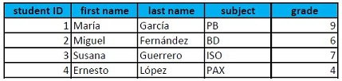

## UF1. Introducció a les bases de dades

### 1. Introducció
Una **dada** és una representació simbòlica (numèrica, alfabètica, …) d'una característica d’una entitat (objecte de la vida real). No té valor semàntic (sentit) per si mateixa. En canvi, si contextualitzem aquesta dada, estem generant **informació**. El ordinadors no són capaços d’interpretar la informació per si mateixos (a diferència dels éssers humans, que sí que ho podem fer). Els programes informàtics però,  necessiten dades (d’entrada) per a poder executar-se, que analitzen i transformen, i així retornar noves dades (de sortida) de valor per a l’usuari del programa.

Les **metadades** són dades sobre les dades. És tota aquella informació descriptiva sobre el context, qualitat, condició o característiques d'un recurs, dada o objecte amb la finalitat de facilitar-ne la recuperació, autentificació, avaluació, preservació i/o interoperabilitat.

Així, disposem de moltes dades que calen relacionar i emmagatzemar, per tal de generar coneixement i per poder accedir a la informació, en qualsevol moment. La col·lecció de dades rellevant per a una entitat (empresa, escola, …) s’anomena **base de dades** (*database*, DB).

### 2. Gestió de les bases de dades
Com s'han gestionat les dades al llarg dels anys? A continuació analitzem les característiques principals de cada periode:
 
**Anys 60 - 70**
- Aplicacions de propòsit específic i processament per lots
- Diferents tipus de suports per a emmagatzemar les dades (cintes magnètiques, targetes microperforades, fitxers)
- **DB redundants**: a cada inserció/modificació es creava un nou fitxer (màster i còpies)
- Bases de dades en xarxa i jeràrquiques


[The CDC 6600 supercomputer, 1964](https://www.advsyscon.com/blog/batch-processing-system/)

**Anys 70 - 80**
- L’aparició dels PCs (Personal Computers) estén la informàtica (empreses i institucions)
- Model E-R (entity-relationship) per Peter Chen (1976)
- Model de base de dades relacional proposat per E. F. Codd al 1970
	- DB relacionals 
	- Primers SGBD comercials (DB2/IBM, Oracle)
- SQL (Structured Query Language) per a gestionar DB relacionals (inicis dels anys 80)


[Característiques principals de SQL](https://skylineittech.com/sql-course/)

**Anys 90**
- Boom de les DB open source (MySQL, PostgreSQL)
- 4GL pel desenvolupament d’aplicacions basades en DB
- Accés online a les DB  (entorn client/servidor)
- Bases de dades distribuïdes


**Actualment**
- TAD (Tipus de Dades Abstractes)
- XML DB per a emmagatzemar tipus de dades complexes
- DB orientades a objectes (OODB)
- NoSQL per a Big Data i aplicacions web en temps real
- Cloud DB (distribució i accés al núvol)


#### DBMS (database management system)
Un database management system (*DBMS*) és un programari o conjunt d’aplicacions que permet accedir a les dades i operar amb elles (creació, modificació, eliminació...) així com atendre les sol·licituds d'accés a la base de dades que fan els usuaris i/o aplicacions a la base de dades. Els DBMS gestionen grans quantitats d’informació, garantint la seva fiabilitat.
#### IS (information system, sistema d’informació, SI)
Un sistema d'informació (*IS*, information system) o SI, en canvi, és un sistema format per persones, dades, activitats, i en definitiva, el conjunt de recursos que processen la informació d'una organització. Els Sistemes d'Informació informàtics són el camp d'estudi de les Tecnologies de la Informació i la Comunicació (TIC).

``` 
Cal diferenciar un sistema d'informació (IS) d'un sistema gestor de bases de dades 
(DBMS), ja que són dos conceptes diferents. 
```

#### Evolució dels DBMS (database management systes)


### 3. Sistemes gestors de bases de dades (DBMS)

Recordem que un DBMS és una eina que permet als usuaris gestionar les bases de dades. Però, quin són els seus objectius principals?

#### Objectius ####

- *Abstracció de la informació*: la forma de l’emmagatzemament físic de les dades és transparent per l’usuari. Existeixen diferents nivells d’abstracció.
- *Independència entre dades i aplicacions*: capacitat de modificar un esquema de definició de les dades sense que això afecti a les aplicacions. Hi ha 2 nivells d'independència:
	- independència física: és possible modificar l'esquema físic sense afectar les aplicacions.
	- independència lògica: és possible modificar l'esquema lògic sense afectar les aplicacions. El programador no ha de conèixer l'estructura interna de les dades per tal de poder manipular-les. És més difícil d'assolir ja que normalment les aplicacions en depenen fortament.
- *Redundància mínima*: cal evitar les repeticions de dades. En principi pot semblar que l'òptim és tenir una redundància mínima o zero però esta demostrat que tenir certa redundància pot ser útil en operacions com la cerca de dades a la base de dades.
- *Consistència*: ha de garantir que les dades han d’estar actualitzades sempre que es vulguin consultar. Molt relacionat amb la redundància (quanta més redundància de dades hi ha, més complicat es mantenir aquestes dades actualitzades en cas d'actualitzacions).
- *Seguretat*: un dels objectius principals dels DBMS és mantenir protegides les dades vers els accessos accidentals o intencionats per part d'usuaris no autoritzats.
- *Integritat*: Són les mesures necessàries que pren el DBMS per tal de garantir la correcció de la base de dades. Les dades poden quedar inconsistents per les següents raons:
	- Errors de maquinari
	- Actualitzacions incompletes
	- Inserció de dades no vàlides.
	- El DBA és qui defineix les regles d'integritat de les dades de la base de dades. Les regles d'integritat tenen 3 components
		- La restricció d'integritat a aplicar
		- La resposta en cas de violació de la restricció
		- La condició d'inici d'aplicació de la restricció (trigger).
- *Recuperació i còpies de seguretat*: El DBMS ha de poder realitzar còpies de seguretat de forma eficient per així evitar la perduda de dades. A les còpies de seguretat són anomenades backups. Per poder restaurar les dades és fa ús dels registres o bitàcoles (arxius de log).
- Control de la *concurrència*: El DBMS ha de garantir que l’accés simultani a les dades i n'ha d'assegurar la consistència de la informació. El més habitual és que una base de dades treballi en un sistema multiusuari i multiprogramat.
- *Temps de resposta*: Les bases de dades estan dissenyades per tal de ser utilitzades per usuaris finals i per tant cal assegurar un temps de resposta adequat per a les epsecificacions de les aplicacions que utilitzen la base de dades.
- Informació sobre les dades o *Metadades*: El sistema ha de tenir informació sobre el mateix sistema (el que s'anomenen metadades), com pot ser els usuaris.

D’altra banda, hem de garantir que les transaccions es realitzin de forma segura complint les propietats ACID:

- *Atomicity* (atomicitat): garanteix que cada transacció es tracta com una única unitat.
- *Consistency* (consistència): garanteix que una transacció únicament pot portar la BD d’un estat vàlid a un altre
- *Isolation* (aïllament): garanteix que transaccions concurrents deixen la DB en el mateix estat que si fóssin seqüencials
- *Durability* (definitivitat): garanteix que un cop finalitzada una transacció, aquesta quedarà desada encara que hi hagi una fallida del sistema

```
Una transacció és tot el conjunt d’operacions que s’han 
de realitzar per a obtenir un resultat .
```

**Funcions, components i tipus

Un DBMS està dissenyat per a la creació, control  i manipulació d’una base de dades.  Les seves funcions essencials són tres:
La descripció de les dades: La definició de l'esquema de la BBDD ha de permetre, una vegada dissenyat, descriure'l mitjançant un conjunt d'instruccions. Això es realitza amb un llenguatge específic denominat Data Definition Language (DDL). 
La manipulació de les dades: L'accés a les dades, en general es realitzarà amb algun llenguatge d'alt nivell, que es recolzarà en un llenguatge específic que rep el nom genèric de Data Manipulation Language (DML). El DML pot utilitzar-se de dues formes, bé incloent sentències DML en programes escrits en llenguatge d'alt nivell, bé mitjançant programes que continguin exclusivament sentències pròpies d'aquest llenguatge. En el primer cas, el SGBD inclouria un precompilador que tradueixi instruccions DML en altres recognoscibles pel compilador del llenguatge d'alt nivell (llenguatge amfitrió).
La utilització de les dades: L'accés a la informació de manera conversacional es refereix a la inclusió d'una interfície d'usuari que permeti introduir sentències directament per a obtenir informació. La funció de gestió de fitxers és realitzada per un mòdul gestor encarregat de la comunicació amb el SOTA i que podrà incloure funcions de control d'usuaris, recuperació enfront de fallades, ….


Components
A nivell extern, un SGBD podria veure's com un sistema compost per maquinari, dades, programes i usuaris.
El maquinari és el component físic on s'emmagatzemen les dades, com ara un sistema de discos redundants o un servidor dedicat. 
Les dades constitueixen la informació, que ha de ser el menys redundant possible. 
Els programes representen la interfície entre dades i usuaris, aconseguint independitzar els aplicacions i SGBD. Són capaços de gestionar les dades i atendre peticions de consulta de més d'una aplicació. 
Els usuaris són la part humana del sistema i es distingeixen diversos rols, com són els usuaris, administradors, programadors i altres.
A nivell intern, el SO proporciona les eines bàsiques de comunicació amb el maquinari, mentre els components d'un SGBD poden varian segons les solucions comercials i la implementació que es faci d'aquest. Però com a components comuns a tots es poden identificar mòduls gestors d'arxius, de BBDD i processadors de consultes.
El mòdul gestor d'arxius administra l'emmagatzematge de les dades en arxius, ja que en l'últim graó, les dades es tracten com a fitxers. El gestor de BBDD està encarregat de comunicar la resta de components amb els arxius proporcionant una interfície amb la BBDD i el processador de consultes és el mòdul encarregat de traduir les consultes d'un llenguatge d'alt nivell com SQL, a consultes de baix nivell, permetent la seva optimització.
Altres components identificables en un SGBD són el llenguatge de descripció de l'esquema conceptual, el llenguatge de definició d'esquemes, mòduls de privacitat i integritat, mòduls generadors d'informes i un llenguatge de consulta de propòsit general.
El llenguatge de descripció de l'esquema conceptual ha de ser senzill i capaç d'avaluar la consistència de dades, mentre el llenguatge de definició d'esquemes, ha de permetre especificar restriccions de privacitat, seguretat i accés. Els mòduls de privacitat tenen entre les seves funcions la protecció de la BBDD enfront d'accessos no autoritzats i el mòdul d'integritat proporcionarà la integritat i coherència de les dades.

Quins són els usuaris principals d’un DBMS?
Podem agrupar-los en 3 tipus diferents:
Usuaris. Es divideixen en dos sub-grups:
usuaris casuals: són usuaris no sofisticats, que no interactuen directament amb el sistema, sinó mitjançant alguna aplicació informàtica desenvolupada prèviament per altres persones amb aquesta finalitat.
usuaris experts: interactuen directament amb el sistema, sense utilitzar les interfícies proporcionades per programes intermediaris. Formulen les consultes en un llenguatge de BD (normalment, SQL), des de dins de l’entorn que el SGBD posa a la seva disposició. Tradicionalment, aquest entorn ha estat una consola en què es podien escriure les consultes, però cada vegada són més freqüents entorns que permeten construir les consultes de mode visual, com autèntiques eines CASE.
Programadors d’aplicacions. Són professionals informàtics que creen els programes que accedeixen als SGBD i que, posteriorment, són utilitzats pels usuaris que hem anomenat externs. Aquestes aplicacions es poden desenvolupar mitjançant diferents llenguatges de programació i eines externes al SGBD. Però molts SGBD comercials també inclouen entorns propis de desenvolupament i llenguatges de quarta generació que faciliten enormement la generació de formularis i informes que permeten visualitzar i modificar les dades.
Administradors d'SGBD. Els administradors són uns usuaris especials que realitzen tasques d’administració i control centralitzat de les dades, i gestionen els permisos d’accés concedits als diferents usuaris i grups d’usuaris, per tal de garantir el funcionament correcte de la BD.
Els administradors han d’actuar, evidentment, per solucionar les eventuals aturades del sistema, però la seva responsabilitat fonamental consisteix, justament, a evitar que es produeixin incidents.
La feina dels administradors no és fàcil, tot i que els SGBD incorporen cada vegada més eines per facilitar-la, i en la majoria dels casos amb interfície visual. Es tracta, per exemple, d’eines de monitoratge de rendiment, d’eines de monitoratge de seguretat, de verificadors de consistència entre índexs i dades, de gestors de còpies de seguretat, etc.
Algunes de les tasques habituals dels administradors són:
Crear i administrar els esquemes de la BD.
Administrar la seguretat: autoritzacions d’accés, restriccions, etc.
Realitzar còpies de seguretat periòdiques.
Controlar l’espai de disc disponible.
Vigilar la integritat de les dades.
Observar l’evolució del rendiment del sistema i determinar quins processos consumeixen més recursos.
Assessorar els programadors i els usuaris sobre la utilització de la BD.
Fer canvis en el disseny físic per millorar el rendiment.
Resoldre emergències.


**Teorema CAP (Consistency, Availability, Partition Tolerance)**

També conegut com a teorema de Brewer, formula que és impossible garantir simultàniament les tres característiques següents en una aplicació distribuïda:
- Consistència: tots els nodes veuen la mateixa dada al mateix temps.
- Disponibilitat: la garantia que cada petició a un node rep una resposta de si ha tingut èxit o a fallat.
- Tolerància a la partició: el sistema continua operant malgrat un error a la xarxa divideixi el sistema ( aïlli certs nodes ).


### 4. Representació de les dades
Organitzem el nostre entorn en “mons”:
- el **món real**: constituït pels objectes (materials o no) de la realitat que ens interessen i amb els quals haurem de treballar
- el **món conceptual**: conjunt de coneixements o informacions obtinguts mitjançant l’observació de la part del món real que ens interessa
- el **món de les representacions**: format per les representacions informàtiques, o dades, del món conceptual, necessàries per poder treballar

#### Conceptualització del nostre entorn 


No podem transformar les observacions del món real en dades informàtiques de manera automàtica, així que cal seguir el procés de disseny següent:
- **fase de disseny lògic**: es treballa amb el model abstracte de dades resultant de finalitzar l’etapa de disseny conceptual, per tal de traduir-ho al model de dades utilitzat pel DBMS amb el qual es vol implementar i mantenir la futura DB.
- **fase de disseny físic**: optimització de l’esquema lògic obtingut en la fase de disseny anterior, per tal d’incrementar l’eficiència en algunes de les operacions a fer amb les dades.

La informació és la conceptualització obtinguda a partir de l’observació del *món real*. Es caracteritza, fonamentalment, per tres elements: entitats, atributs i valors. 
- Les *entitats* són els objectes del món real que conceptualitzem. Són identificables, és a dir, distingibles els uns dels altres. I ens interessen algunes (com a mínim una) de les seves propietats (atributs).
Exemple: Cotxe, Alumne, Banc, Moble
- Els *atributs* són les propietats que ens interessen de les entitats. 
Exemple: color, edat, oficina, material
- Els *valors* són els continguts concrets dels atributs, les determinacions concretes que assoleixen.
Exemple: vermell, 17, BCN-003, fusta

```
A més dels tres elements bàsics que caracteritzen la informació 
(entitats, atributs i valors), cal tenir en compte el factor cronològic, 
ja que la informació no és independent del temps.
```

##### Entitats
Quan parlem d’una entitat, cal diferenciar entre **entitat tipus** i **entitat instància**.
- **entitat tipus (_template_)**: tipus genèric d’entitat (abstracció), que fa referència a una classe de coses (cotxe, arbre, alumne,...)
- **entitat instància**: conceptualització d’un objecte concret del món real (Ford Mustang Vermell), distingible dels altres objectes del mateix tipus, gràcies a alguna propietat (com podria ser el valor de l’atribut matrícula).

##### Atributs
Tal i com hem dit, els atributs són les propietats que ens interessen de les entitats que hem de modelar. Aquestes propietats poden tenir valors diferents i es poden realitzar una sèrie d’operacions entre aquests valors (calcular edats, comparar salaris, …).

Un **tipus de dada** defineix un conjunt de valors amb unes característiques comunes que els fan compatibles, per la qual cosa també defineix una sèrie d’operacions admissibles sobre aquests valors. Exemple: enters, caràcters, booleans,...

Perquè un valor d’un atribut sigui vàlid, ha de pertànyer al conjunt de valors acceptables per a l’atribut en qüestió. Aquest conjunt de valors vàlids s’anomena **domini**. Un domini pot ser predefinit (enters, reals,...) o definit per l’usuari (rang d’edat).

De vegades, el valor d’un atribut és desconegut o, fins i tot, no existeix. El **valor nul** indica que no hi ha cap valor associat a un atribut determinat d’una entitat instància concreta.

Un **atribut identificador** és el que permet distingir inequívocament cada entitat instància de la resta. En ser un valor és únic, aquest no es repeteix en les diferents entitats instància. Tot atribut o conjunt d’atributs que permeten identificar una entitat tipus rep el nom de **clau**.

#### Representacions informàtiques

Recordem que una *dada* és una representació simbòlica (numèrica, alfabètica, …) d'una característica d’una entitat (objecte de la vida real). Per tal de processar i analitzar un conjunt de dades, hi ha diversos tipus de representació. La forma més habitual és la **representació tabular**.



Cada taula representa una entitat tipus, i està estructurada en files (agrupacions horitzontals de cel·les) i columnes (agrupacions verticals de cel·les):
- cada fila representa una entitat instància (*registre*).
- cada columna representa un atribut (*camp*).
- cada cel·la (cada intersecció d'una fila i d'una columna) emmagatzema el *valor* que tingui l'atribut de l'entitat instància corresponent.

A més de poder emmagatzemar les dades, caldrà poder accedir i operar amb elles. Bàsicament, hi ha dues maneres d'accedir a les dades:
- L'**accés seqüencial** a un registre determinat, que implica l'accés previ a tots els registres anteriors.
- L'**accés directe** a un registre concret, que implica l'obtenció directa del registre desitjat.

A més, hi ha una altra classificació habitual de tipologies d'accessos:
- L'**accés per valor**, que permet l'obtenció del registre desitjat en funció del valor d'algun (o alguns) dels seus camps, sense considerar la posició que ocupa el registre.
- L'**accés per posició**, que obre l'accés a un registre que ocupa una posició determinada, sense considerar el contingut del registre.

Les quatre tipologies d'accés a dades més freqüents:
- **SP** (*accés seqüencial per posició*): un cop s’ha accedit a un registre que es troba en una posició determinada, s'accedeix al registre que ocupa la posició immediatament posterior.
- **DP** (*accés directe per posició*): s'obté directament un registre pel fet d'ocupar una posició determinada.
- **SV** (*accés seqüencial per valor*): un cop s’ha accedit a un registre que té un valor concret, s'accedeix al registre que ocupa la posició immediatament posterior, segons l'ordenació establerta a partir un camp determinat (o més). L'ordre serà creixent o decreixent, si es tracta d'un camp numèric, o alfabètic ascendent o descendent, si es tracta d'un camp de caràcters.
- **DV** (*accés directe per valor*): s'obté directament un registre pel fet de tenir un valor determinat en un dels seus atributs (o més).

|				     | **P - posició** | **V - valor**  |
| ------------------ | --------------- | -------------- |
| **S - seqüencial** | SP 		       | SV			    |
| **D - directe**    | DP              | DV			    |

Taula 1. Mètodes d’accés a les dades

A l’hora de parlar de les representacions informàtiques de dades, cal tenir en compte els nivells de representació:

- **nivell lògic**: es treballa segons la conceptualització de les dades, sense necessitat de saber com s’emmagatzemen de manera física
- **nivell físic**: requereix un coneixement a baix nivell de la implementació física de l'organització de les dades i l'accés a aquestes

Aquest model però, no garanteix totalment la independència entre dades i aplicacions, així que l’any 1975, l’Organisme d’Estandarització dls Estats Units (ANSI) proposa una arquitectura a 3 nivells, anomenada Arquitectura ANSI/X3/SPARC:

1. **Nivell Extern o Lògic** (*User Views*): descriu una part de la base de dades rellevant per a aquest usuari i s’exclouen dades irrellevants o a les quals no té permisos d'accés
2. **Nivell Conceptual**: descriu les dades a emmagatzemar dins la base de dades i com estan interrelacionades, sense especificar com s'emmagatzemen físicament
3. **Nivell Intern o Físic**: implica com es representa físicament la base de dades al sistema informàtic, descrivint com s'emmagatzemen realment a la base de dades i al maquinari de l'ordinador


[Els tres nivells de l’arquitectura ANSI-SPARC](https://en.wikipedia.org/wiki/ANSI-SPARC_Architecture)

L'avantatge d'aquesta arquitectura en nivells és que proporciona independència lògica i física de les dades respecte a les aplicacions:

- **Independència lògica**: es poden fer canvis en el nivell conceptual (afegir taules o atributs) sense que sigui necessari reescriure totes les aplicacions.
- **Independència física**: és possible modificar la ubicació dels fitxers que contenen les dades sense que es vegin afectades les aplicacions.


### Bibliografia

- [**Fundamentos de bases de datos. SILBERSCHATZ, KORTH, SUDARSHAN. 6ª Edición. McGrawHill Education**](https://www.casadellibro.com/libro-fundamentos-de-bases-de-datos/9788448190330/2303933)
- [**Bases de dades. Planas, Jaume Sistac. Edicions de la Universitat Oberta de catalunya, 1a Edició (2000)**](https://www.editorialuoc.cat/bases-de-dades)
