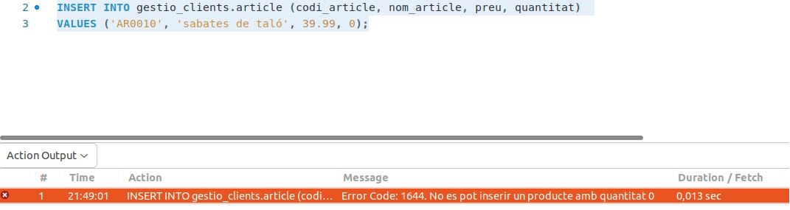
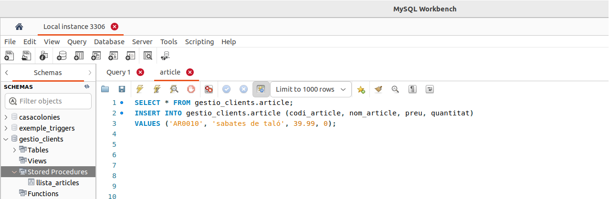

## UF3. Llenguatges SQL: DCL i extensió procedimental

### Projecte d'aula: Gestió de clients

1 - Implementem la base de dades on desenvoluparem el projecte (**gestio_clients**). 

```
CREATE DATABASE IF NOT EXISTS gestio_clients;
```

2 - Indiquem al DBMS que treballarem dins d'aquesta db:

```
USE gestio_clients;
```

3 - Implementem la taula per a emmagatzemar articles:

```
CREATE TABLE IF NOT EXISTS article (
	codi_article VARCHAR(6) NOT NULL,
	nom_article VARCHAR(25) NOT NULL,
	preu FLOAT DEFAULT NULL,
	quantitat INT DEFAULT NULL,
	PRIMARY KEY (codi_article)
);

```

4 - Inserim un registre i executem una query bàsica, per comprovar que tot és correcte:

```
INSERT INTO article (codi_article, nom_article, preu, quantitat) 
VALUES ('AR001', 'pantaló', 20.50, 50), ('AR002', 'camisa', 17.50, 75), ('AR003', 'samarreta', 10.00, 100), ('AR004', 'gorra', 6.00, 25);

SELECT * FROM article;
```

5 - Implementem la taula **log_article** per a registrar canvis a la taula d'articles, mitjançant el trigger vinculat a la taula article:

```
CREATE TABLE IF NOT EXISTS log_article (
	codi_article VARCHAR(6) NOT NULL,
	usuari VARCHAR(25) NOT NULL,
	data DATETIME NOT NULL,
	PRIMARY KEY (codi_article)
);
```

6 - Definim el trigger, que s'executar després d'inserir un registre en la taula d'article. Després inserim un registre, per comprovar que funciona correctament:

```
--NEW.codi_article: retorna el codi de l'article inserit 
--CURRENT_USER(): retorna l'usuari que executa l'acció (inserció article)
--NOW(): retorna la data i hora en la que s'executa l'acció
delimiter //
CREATE TRIGGER article_ai AFTER INSERT ON article 
FOR EACH ROW	
	INSERT INTO log_article (codi_article, usuari, data) 
	VALUES (NEW.codi_article, CURRENT_USER(), NOW()); //
delimiter ;


INSERT INTO article (codi_article, nom_article, preu, quantitat) 
VALUES ('AR006', 'vestit', 105.20, 10);

```

7 - Si volem enregistrar els valors antics i nous d'un article, cal modificar la taula **log_article** per poder emmagatzemar aquesta valors:

```
ALTER TABLE log_article CHANGE COLUMN codi_article codi_article_old varchar(6) NOT NULL;
ALTER TABLE log_article ADD codi_article_new VARCHAR(6) DEFAULT NULL; 
ALTER TABLE log_article ADD nom_article_old VARCHAR(25) DEFAULT NULL;
ALTER TABLE log_article ADD nom_article_new VARCHAR(25) DEFAULT NULL;
ALTER TABLE log_article ADD preu_old FLOAT DEFAULT NULL;
ALTER TABLE log_article ADD preu_new FLOAT DEFAULT NULL;
ALTER TABLE log_article ADD quantitat_old INT DEFAULT NULL;
ALTER TABLE log_article ADD quantitat_new INT DEFAULT NULL;
```

8 - Implementem el trigger per tal que s'executi en actualitzar un registre i actualitzem un article per comprovar que funciona correctament:

```
delimiter //
CREATE TRIGGER article_au AFTER UPDATE ON article 
FOR EACH ROW	
	INSERT INTO log_article (codi_article_old, codi_article_new, nom_article_old, nom_article_new, preu_old, preu_new, quantitat_old, quantitat_new, usuari, data) 
	VALUES (OLD.codi_article, NEW.codi_article, OLD.nom_article, NEW.nom_article, OLD.preu, NEW.preu, OLD.quantitat, NEW.quantitat, CURRENT_USER(), NOW()); //
delimiter ;

UPDATE article SET preu = 105.5 WHERE codi_article = 'AR007';
```

9 - Implementem dos triggers de control en la inserció i modificació d'articles. El primer, avisarà que no es poden inserir articles si la quantitat és 0 (declarem una variable de sistema). En el segon, en canvi, declarem variables locals i controlarem amb un valor inicial (en cas que s'actualizti amb un preu negatiu). En tots dos casos, executem les sentències corresponents per a comprovar el bon funcionament dels triggers:

```
delimiter //

CREATE TRIGGER article_bi BEFORE INSERT ON article
  FOR EACH ROW
  BEGIN
    IF NEW.quantitat < 0 THEN
    	SIGNAL SQLSTATE '45000' SET MESSAGE_TEXT = 'No es pot inserir un producte amb quantitat 0';
    END IF;
  END;
//

INSERT INTO article (codi_article, nom_article, preu, quantitat) 
VALUES ('AR005', 'faldilla', 25.15, 0);

delimiter //

CREATE TRIGGER article_bu BEFORE UPDATE ON article
  FOR EACH ROW
  BEGIN
    IF NEW.preu < 0 THEN
    	SET NEW.preu = 0;
    ELSEIF NEW.preu > 200 THEN
        SET NEW.preu = 150;
    END IF;

  END;
//
delimiter ;

UPDATE article SET preu = 0 WHERE codi_article = 'AR007';
```

En intentar inserir un article amb quantitat 0 (trigger *article_bi*), apareix un missatge indicant l'error:



10 - Volem disposar de diverses estadístiques. Per això, es crearà una taula: 

```
CREATE TABLE IF NOT EXISTS stats_article (
	id_accio INT NOT NULL AUTO_INCREMENT,
	total_productes INT DEFAULT NULL,
	total_quantitat INT DEFAULT NULL,
	data DATETIME DEFAULT NULL,
	PRIMARY KEY (id_accio)
);
```

Aquesta taula s'omplirà amb els valors calculats per un trigger, en inserir un nou article:

```
delimiter //

CREATE TRIGGER article_ai AFTER INSERT ON article
  FOR EACH ROW
  BEGIN
  
    DECLARE total_productes INT;
    DECLARE total_quantitat INT;
    
    SELECT COUNT(*) 
    INTO total_productes
    FROM article;
    
    SELECT SUM(preu*quantitat) 
    INTO total_quantitat
    FROM article;
      
    IF total_productes > 0 THEN
        INSERT INTO stats_article(id_accio, total_productes, total_quantitat, data)
        VALUES(NULL, total_productes, total_quantitat, NOW());
    END IF;

  END;
//
delimiter ;

INSERT INTO article (codi_article, nom_article, preu, quantitat) 
VALUES ('AR008', 'pijama', 20.5, 50);
```

11 - També es vol mantenir un registre dels articles eliminats. És a dir, cal tenir la taula d'articles neta, per això s'haurà d'anar esborrant (si és necessari) però en cas que s'elimini un article, es vol enregistrar qui ha realitzat aquesta operació i quan, a més dels atributs de l'article:

```
CREATE TABLE IF NOT EXISTS deleted_article (
	codi_article VARCHAR(6) NOT NULL,
	nom_article VARCHAR(25) NOT NULL,
	preu FLOAT DEFAULT NULL,
	quantitat INT DEFAULT NULL,
  usuari VARCHAR(25) NOT NULL,
	data DATETIME NOT NULL,
	PRIMARY KEY (codi_article)
);

delimiter //
CREATE TRIGGER article_ad AFTER DELETE ON article
  FOR EACH ROW
  BEGIN
	INSERT INTO deleted_article (codi_article, nom_article, preu, quantitat, usuari, data)
	VALUES (OLD.codi_article, OLD.nom_article, OLD.preu, OLD.quantitat, CURRENT_USER(),NOW());
  END;
//

delimiter ;

DELETE FROM article WHERE codi_article = 'AR009';
SELECT * FROM deleted_article;

```
12 - Comencem a implementar procediments que permetin fer crides automàtiques a la bbdd. El primer *procedure* ens retornarà el llistat de tots els articles:

```
delimiter //
CREATE PROCEDURE llista_articles()
SELECT * FROM article;//
delimiter ;

```

Per executar-lo, cal fer una crida mitjançant la instrucció CALL:

```
CALL llista_articles();
```

En aquest cas, veurem en MySQL Workbench que el procedure apareix en una secció pròpia, ja que està relacionat amb la base de dades:

